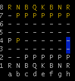
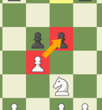
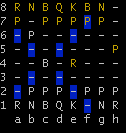
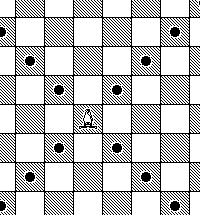
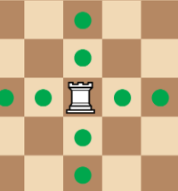

# CHESS GAME 
The game was made in the java programming language using the eclipse IDE, the game was made for learning and fun, following all the logic of the game such as check/checkmate, special moves, changing players each turn, possible moves for each piece, specific classes and inheritance, exception handling and much more.

## Understanding the interface

images/ImageChess1.png

## Exceptions

This exception occurs when your King is in check

This exception occurs when a part is selected without any possible movement

This exception occurs when you try to select a part that is not yours
 

## Image Possible Movements

### Pawn represented by P

  
  

### Movement pawn and special move En Passant example

  
  

### Bishop represented by B

  
  

### Knight represented by N

  
  

### Queen represented by Q

  
  

### Rook represented by R

  
  

### King represented by K

  
  

  
