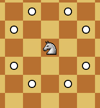
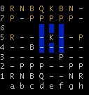

# Chess Game 
The game was made in the java programming language using the eclipse IDE, the game was made for learning and fun, following all the logic of the game such as check/checkmate, special moves, changing players each turn, possible moves for each piece, specific classes and inheritance, exception handling and much more.

## Index
- <a href="#understanding-the-interface">Understanding the interface</a>
- <a href="#how-to-run-the-project">How to run the project</a>
- <a href="#exceptions">Exceptions</a>
- <a href="#image-possible-movements">Possible movements of the pieces</a>
- <a href="#author">Author</a>

## Understanding the interface

The chess game is always shown above, then we have the pieces captured from the game, both white and black (yellow) because the background of the terminal is already black, every round will be shown by its turn and together with the turn of the player that would be the white or black pieces.

To start, enter column (a, b, c, d...) + row (1, 2, 3, 4...) As an example **source: a2** after entering your chosen piece, it will show the possible positions for moving. <a href="#image-possible-movements">Possible movements of the pieces</a>, then enter the target position of the chosen part and so on.

## Exceptions
<div>This exception below occurs when your King is in check</div>


<div>This exception below occurs when a part is selected without any possible movement</div>


<div>This exception below occurs when you try to select a part that is not yours</div> 


<div>This exception below occurs when the chosen target position is not a valid movement for this piece</div>


<div>This exception below occurs when the chosen position is not a chessboard position</div>


## How to run the project
- First step: 

Create a folder on your computer where the repository will be cloned, inside it press the right button and enter the bash terminal if you don't get it enter this link for the download **<a href="https://git-scm.com/downloads">git</a>**

Or simply download the project by going to the top of the page and clicking on Code > Download ZIP

- Second step:

If you have already downloaded the project directly from Code > Download ZIP you don't need to do this step

Copy and paste the code below into your git bash in the folder you created in step 1
```bash
# Cria pasta .git
git init
```
```bash
# Clone este repositorio
git clone https://github.com/Renan-amc/chess-system-java
```

- Step three:

Now having obtained the cloned project, go into the "chess-game-java/bin" folder

- Step four: 

Inside the “bin” folder, right-click and enter a terminal, below I'll show you how to enter the git bash terminal


- Step five:

Now, in the terminal, type or copy and paste: 
```
java application/Program
```
If all goes well, the chess game will start and the screen described in **<a href="#understanding-the-interface">Understanding the interface</a>**.


## Image Possible Movements

### Pawn represented by P
<div>
  
  
</div>

### Movement pawn and special move En Passant example
<div>
  
  
</div>

### Bishop represented by B
<div>
  
  
</div>

### Knight represented by N
<div>
  
  
</div>

### Queen represented by Q
<div>
  
  
</div>

### Rook represented by R
<div>
  
  
</div>

### King represented by K
<div>
  
  
</div>

## Author
Renan Alexandre Maciel Couto

👩‍💻<a href="https://www.linkedin.com/in/renan-couto-307109237/"> **Linkedin**</a>
🙎‍♂️<a href="https://wa.me/35988832083"> **Whatsapp**</a>
📱 <a href="https://github.com/Renan-amc"> **Github**</a>
  
